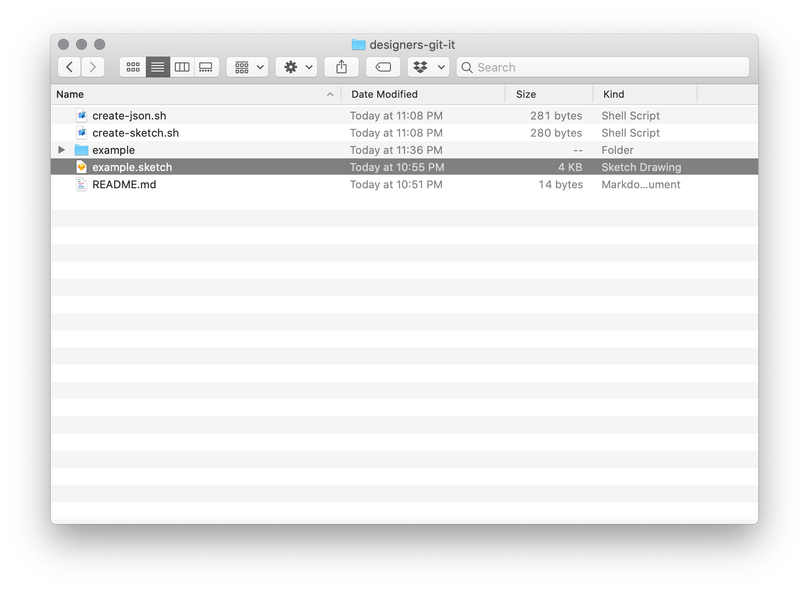

## Update
This is a tutorial for a presentation I gave at [Git-Merge 2018](https://www.youtube.com/watch?v=A-lNv6Szu3M) before tools like Abstract, Kactus and others where more popular. These tools provide a ton of value to the design process, and I highly recommend your check them out. I do still find value in this workflow, but have not put as much focus into it. Hope it is still of use. 

## Overview
Until recently design files had underlying binary file systems, this made them difficult to version control or keep track of the latest updates to a file. Sketch recently shifted their file system to `json` which makes it really easy handle version control for design files. 

In this post I'll give you a quick rundown on how you can version control your design files with a few simple bash scripts. I am assuming that you have an understanding of Git, I highly recommend this [tutorial](https://www.taniarascia.com/getting-started-with-git/) from Tania Rascia.

## Getting started
The source files for this tutorial can be for [here.](https://github.com/stphnhthwy/designers-git-it) You will find a `create-json.sh` and `create.sketch.sh` files, as you can probably guess the scripts either create a json file or a sketch file. 

Inside of your folder save your Sketch file. 


### Open create-json.sh

Inside of that file add your file name to `files="example"`
```bash
files="example"  # add a new file like this: "example, example-1, example-2"
for f in $files
do
  # Zip core Sketch data
  cd $f/ && zip $f.zip -r .

  # Copy .zip to .sketch
  cp $f.zip ../$f.sketch

  # Remove zip hello this is a change
  rm -Rf $f.zip && cd ..
done
```

You will do the same thing inside of `create-sketch.sh`

### Open create-sketch.sh
Inside of that file add your file name to `files="example"`

```bash
files="example" # add a new file like this: "example, example-1, example-2"
for f in $files
do
  # Copy .sketch to .zip
  cp $f.sketch $f.zip

  # Unzip the file and delete
  unzip -o $f.zip -d $f/
  rm -Rf $f.zip

  # Remove the preview file
  rm -Rf $f/previews/
done
```

## Create json files
Open up your Terminal and `cd` the folder you saved our bash scripts and sketch file. Type in `sh create-json.sh` script.


You will see that the script expands the Sketch file and creates a new folder with the same name as your Sketch file.



If you navigate to the Example folder you will see the `json` files are now exposed for you to Version Control. 


## Create sketch files
Much like the `create-json.sh` script `create-sketch.sh` creates your Sketch files that you can use to design with. Inside of Terminal `cd` the folder you have saved your bash scripts and sketch file. Type in `sh create-json.sh` script.


### Open Sketch
You can now open that Sketch file and make edits to your file. 


## Limitations
This is a great initial step for Version Control with deign files. The limitations that need to be solved are.

- Ability to see difs between versions.
- Manual process that most designers wont do.
- Ability to pull assets or information from the `json` files straight into the code base.

## Resources
- [Source](https://github.com/stphnhthwy/designers-git-it)
- [Git-Merge Presentation](https://www.youtube.com/watch?v=A-lNv6Szu3M)