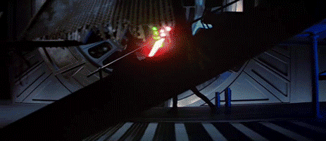
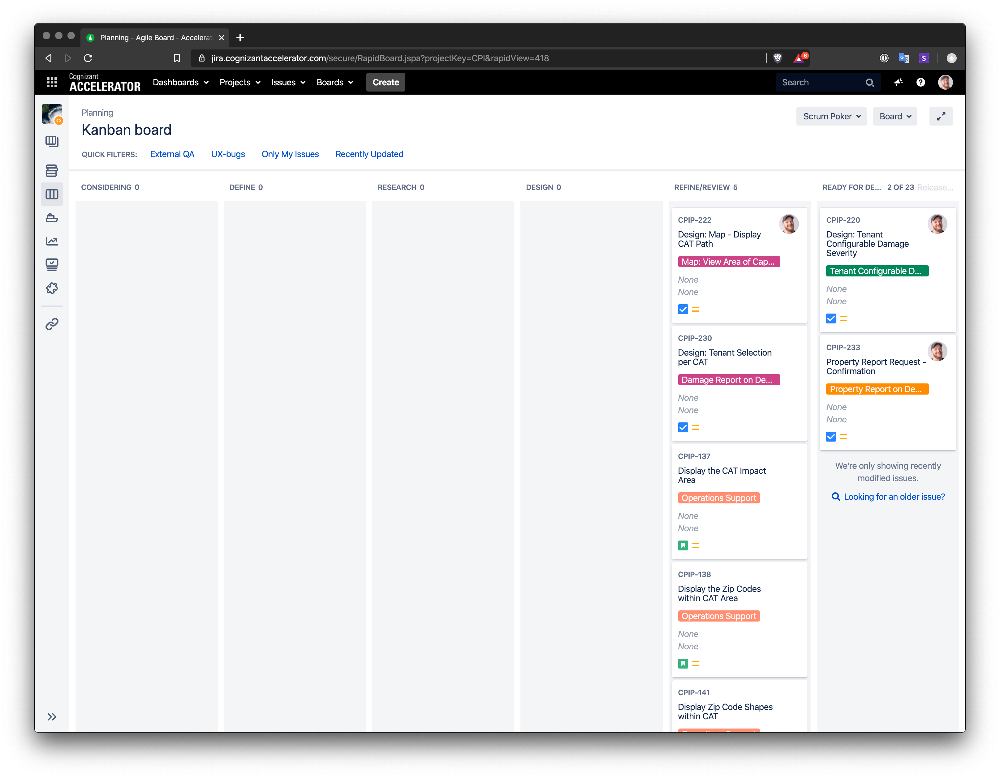
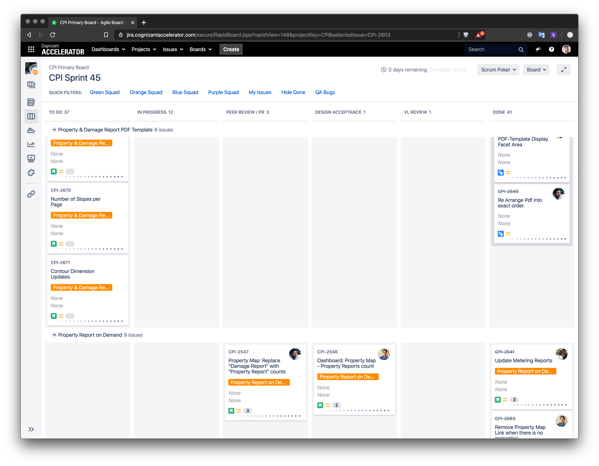

Throughout the past year, I had a reoccurring question pop-up in the back of my mind. 

> How can design work better with development?

I don't think it is a secret that design has struggled with fitting into an Agile process. Rules, deadlines, and metrics can be terrifying to us on the "creative" side. Design can be a meandering mess of things, but we come out those walks with unknown discoveries and unexpected outcomes that help push the team and product forward. This provides tremendous value to a team, but it can create problems other issues, such as leaving other parts of the team feeling like we are "throwing designs over the wall" to development. 

This honestly left me feeling like you had to choose between a Light Side and a Dark Side with no ability to bring balance to the Galaxy. On the Light Side creativity, unknowns, adventure and on the Dark Side metrics, two-week timelines, user stories. It all felt way to scripted - that design would lose their ability to be creative, to challenge the status quo and build something unique. 

After spending time asking the product team how the design process affects their role, what became apparent was the desire for more involvement throughout the design process. Everyone wanted to see designs earlier, understand what we were working on, and provide feedback. 

**Did they possibly want to join the Light Side!?**

Throughout the investigation I noticed myself changing as well, I wanted to get better at delivering designs that were validated, researched, and ready to go that didn't surprise the development team. 

**Was I being seduced by the Dark Side!?**

All jokes aside, I do think that design and development can bring balance to the Galaxy and work together in an Agile environment. I want to illustrate that everyone on a product team should have room for creativity, unknowns, adventure, but having timelines, user stories and collaboration creates an environment were the whole team is delivering their best work. 

### What is Dual Track
Dual Track is a process that aims to enable cross-functional teams to **communicate** and **collaborate** on design and delivery throughout sprints. This takes shape by having two tracks - Planning and Delivery with on team working together on **both** at the same time. 

## Planning

Ideas from Product Owners and Backlog are funneled into our Planning board. As a team, we decided to separate this out into its own Project inside of Jira. This created transparency for the whole team to see what design was working, the status of that work and the ability for anyone to collaborate or provide feedback. 

### Considering
Considering is used by our Product Owners and Managers, to bring the next body of work into the forefront. These ideas usually come from Research, BA's or the Backlog. This effectively becomes the Backlog for Design and Research. The "stories" introduced here are more at an Epic level and will be broken down more granularly later on in the process. 

### Define
The team picks up Stories from the Considering column and starts to Define all aspects of that work. This creates transparency and open dialogue for everyone on the team. At this point, we will decide which opportunities, ideas or problems are worth progressing forward. 

### Research
This can be ongoing research that is carried out by the UX team but provides a way for the wider team to provide feedback and insight as much as possible. On occasion, the business may need a better understanding before it can be pushed into the Design column.

### Design
The knowledge and information accumulated from the team, and research kick-off Design to provide workflows and mockups for that problem. As a design team, we provide links to In Progress work within Jira Stories, providing transparency into the designed solution. Any team member is able to comment with InVision or Jira. Once a design is ready for Review we push that along and review with Product Owners.

### Refine & Review
The team will Review any outcomes from Research or Design, these sessions are handled like any other review session. The Research team will provide a readout and share findings. The design team will provide workflows and design comps for review or approval. Team leads are invited to these review sessions and provide feedback. With the transparency throughout the process, few team members are surprised or shocked by the solutions the team has come up with. This has helped us get work approved and ready for development quicker. 

### Ready for Development
Once designs have been approved by the Product Owner the design team will prep the story for development. As a design team, we upload the stories to InVision, provide links, documentation, etc. 

Engineering Managers and Product Managers will break the design work down into more granular Stories for Delivery. 

## Delivery

Stories coming into the Delivery phase of our process are clearly defined and ready to be executed on. The standard Agile process comes to light here, the development has clearly defined workflows that are documented. Our team has a Kanban board with these columns. 

- To-Do
- In Progress
- Peer Review
- Design Acceptance
- Review
- Done

## Learning
When we first implemented this process, I was nervous that design would lose its identity, we would succumb to the Dark Side of Agile and be lost in Jira land. What actually happened was everyone was able to be a part of the solution from the start. Development was able to provide feedback and insight into the design process. The design team was able to hand off work in a cohesive package that wasn't "thrown over the wall". We worked better as a team. 

## Further Reading
<a href="https://www.gv.com/sprint/" target="_blank">The Design Sprint</a>

<a href="https://www.jpattonassociates.com/dual-track-development/" target="_blank">Dual Track Development is not Duel Track</a>

<a href="https://medium.com/design-optimizely/managing-design-work-with-discovery-kanban-at-optimizely-9918e7959be5" target="_blank">Managing Design work with Discovery Kanban at Optimizely</a>

<a href="https://medium.com/@dannyvigil/dual-track-agile-level-up-enterprise-product-design-with-ux-part-3-25cafc1d6aa5" target="_blank">Dual Track Agile: Level Up Enterprise Product Design with UX Part 3</a>